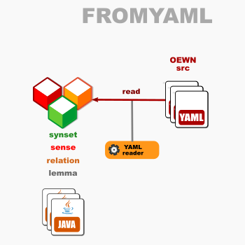

# OEWN model-from-YAML

This reads a model from YAML files.

Project [fromyaml](https://github.com/oewntk/fromyaml)

## Dataflow

## Maven Central

		<groupId>io.github.oewntk</groupId>
		<artifactId>fromyaml</artifactId>
		<version>1.0.0</version>
